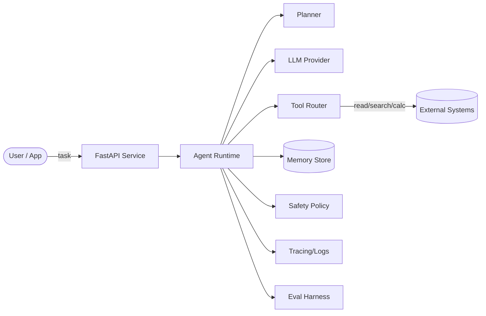

# AGI Framework

> **Status:** Research / engineering scaffold for building *agentic* AI systems (tool-use + memory + planning + eval + safety).
>
> **Important reality check:** **Artificial General Intelligence (AGI) does not exist today.** This repository is **not** a recipe to create AGI. It is a modern, production-minded **framework template** that organizes the components you typically see in "AGI framework" repos: agents, tools, memory, planners, evaluation, safety guardrails, observability, APIs, and examples.

---

## Why this repo exists

Most "AGI framework" repositories in 2024–2026 converged on a few common building blocks:

- **Tool-using agents** (e.g., ReAct-style loops)
- **Planning/search** (task decomposition, tree search, reflection)
- **Memory** (short-term context + long-term retrieval)
- **RAG / grounding** (retrieve external facts/docs to reduce hallucination)
- **Safety and governance** (policy, access control, red-teaming, audit logs)
- **Evaluation** (benchmarks, regression tests, scenario suites)
- **Ops** (tracing, metrics, API service, CI)

This repo is a *starter kit* that includes **structure + docs + runnable reference code** so you can adapt it to your organization, model providers, and deployment environment.

---

## Repository map (high-level)

- `src/agi/` — core framework code (agents, tools, memory, safety, eval)
- `docs/` — architecture docs, diagrams (Mermaid), use-cases, governance, references
- `examples/` — runnable example agents & pipelines
- `configs/` — YAML configs for agents, tools, policies
- `tests/` — unit tests + small eval smoke tests
- `.github/workflows/` — CI: lint, typecheck, tests

---

## Quickstart (local)

### 1) Create a virtual environment

```bash
python -m venv .venv
source .venv/bin/activate   # (Windows: .venv\Scripts\activate)
```

### 2) Install

```bash
pip install -e ".[dev]"
```

### 3) Run the CLI using the built-in Mock LLM

```bash
agi run "What is 23*19? Use the calculator tool."
```

### 4) Start the API server

```bash
agi serve --host 0.0.0.0 --port 8000
```

Then call:

```bash
curl -s http://localhost:8000/v1/agent/run \
  -H "Content-Type: application/json" \
  -d '{"task":"Summarize the safety policy in one paragraph."}'
```

---

## Architecture at a glance



See: `docs/architecture/` for deeper diagrams, dataflows, and threat model.

---

## Use cases included

- **Research assistant**: retrieve notes, cite sources, produce summaries
- **Dev assistant**: propose patch plans, run tests, generate PR-ready diffs (no auto-push)
- **Workflow runner**: deterministic tool pipelines for business processes
- **Multi-agent “team”**: coordinator + specialists (planner, coder, reviewer)
- **Simulation agent**: memory + reflection + persona constraints

See: `docs/use_cases/` + `examples/`.

---

## Safety + governance (built in)

This repo is designed to be safe-by-default:

- Tools are **denylisted** by default (no network, no file writes).
- Policies are explicit in `configs/policy.default.yaml`.
- All tool executions are logged via the observability layer.
- Prompts and traces can be redacted to avoid leaking secrets.

See: `docs/safety/` and `docs/governance/`.

---

## Mirroring to GitHub (github.com/kennyb7322/AGI)

If you want this scaffold under your GitHub repo:

```bash
git init
git add .
git commit -m "Initial AGI framework scaffold"
git branch -M main
git remote add origin git@github.com:kennyb7322/AGI.git
git push -u origin main
```

---

## License + confidentiality

By default, this repo ships with a **proprietary/confidential template license**.
If you want to open-source it, replace `LICENSE` with `LICENSE-MIT.txt` or `LICENSE-APACHE-2.0.txt` and remove confidentiality markings.

See: `LICENSE`, `NOTICE`, and `CONFIDENTIALITY.md`.

---

## Disclaimer

This repository contains **general-purpose agent scaffolding**. Do **not** use it to:
- perform unauthorized access,
- run uncontrolled autonomous actions,
- or deploy in safety-critical settings without proper review.

You are responsible for complying with laws, contracts, and your organization’s policies.

---

© 2026 Kenny B (kennyb7322). All rights reserved.
