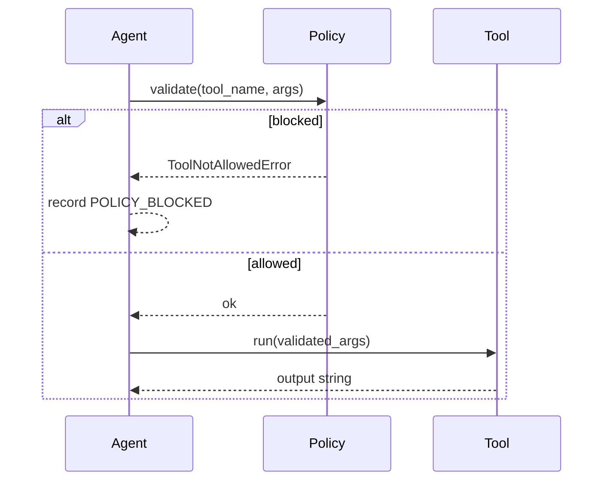

# Dataflow

This page shows the *message and state* flow inside the agent loop.

## Message flow

1. `system` message contains:
   - system prompt
   - tool catalog
   - safety policy summary
   - retrieved memory snippets (if enabled)
2. `user` message contains the task
3. LLM returns either:
   - a JSON tool action, or
   - a JSON final action, or
   - plain text (treated as final)

## Tool flow (explicit)

## State flow (memory + traces)

- Memory: a lightweight SQLite DB used for simple keyword retrieval.
- Traces: JSONL event stream under `workspace/traces/trace.jsonl`.

Production deployments typically:
- replace SQLite with a vector DB + embeddings,
- export traces to a centralized observability system.

