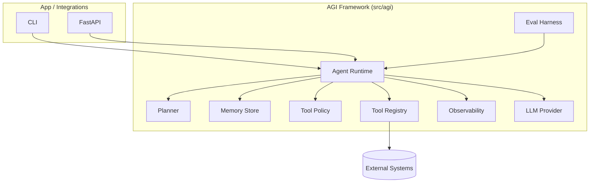

# Architecture overview

The repo is organized around **boundaries** that correspond to common failure modes in agentic systems:

1. **LLM boundary**: a provider wrapper that can be swapped.
2. **Tool boundary**: deterministic, typed tools, invoked explicitly.
3. **Safety boundary**: policy checks for every tool call.
4. **State boundary**: memory + traces persist what happened.
5. **Evaluation boundary**: tests and eval suites prevent regressions.

## Layered architecture

## Runtime invariants (what should always be true)

- Tool invocations are **explicit** and **audited**.
- Policy checks happen **before** tool execution.
- Tool outputs are treated as **untrusted** and truncated when necessary.
- Logging can be configured to **redact** secrets.

