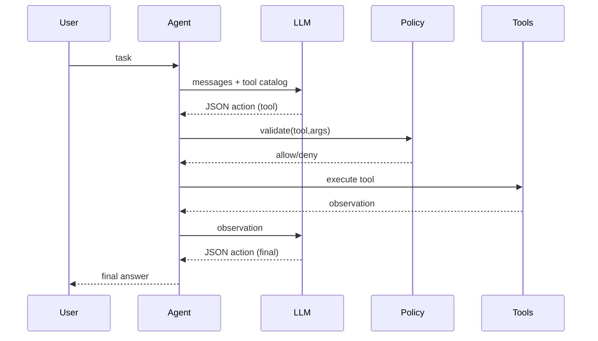

# AGI Framework docs

This documentation explains the **architecture and design choices** behind the repository.

> **Reminder:** this repository is a framework scaffold for *agentic systems*, not an implementation of real AGI.

## What you get out of the box

- Agent runtime with explicit tool calls (JSON action contract)
- Tool registry + built-in tools (calculator, file read/write, HTTP GET)
- Safety policy layer (deny-by-default network and file writes)
- SQLite memory store (simple baseline)
- FastAPI service + Typer CLI
- MkDocs documentation + Mermaid diagrams
- Tests and CI scaffolding

## Suggested learning path

1. Read **Architecture → Overview**
2. Read **Safety → Prompt injection** and **Threat model**
3. Run an example from `examples/`
4. Customize `configs/app.default.yaml` and add your own tools

## Key design principle: explicit interfaces

Agentic systems become brittle when tool use is implicit and uncontrolled.
This framework forces explicit boundaries:

- **Tools are callable functions with typed inputs**
- **Policies gate all tool calls**
- **Tracing logs every call**

