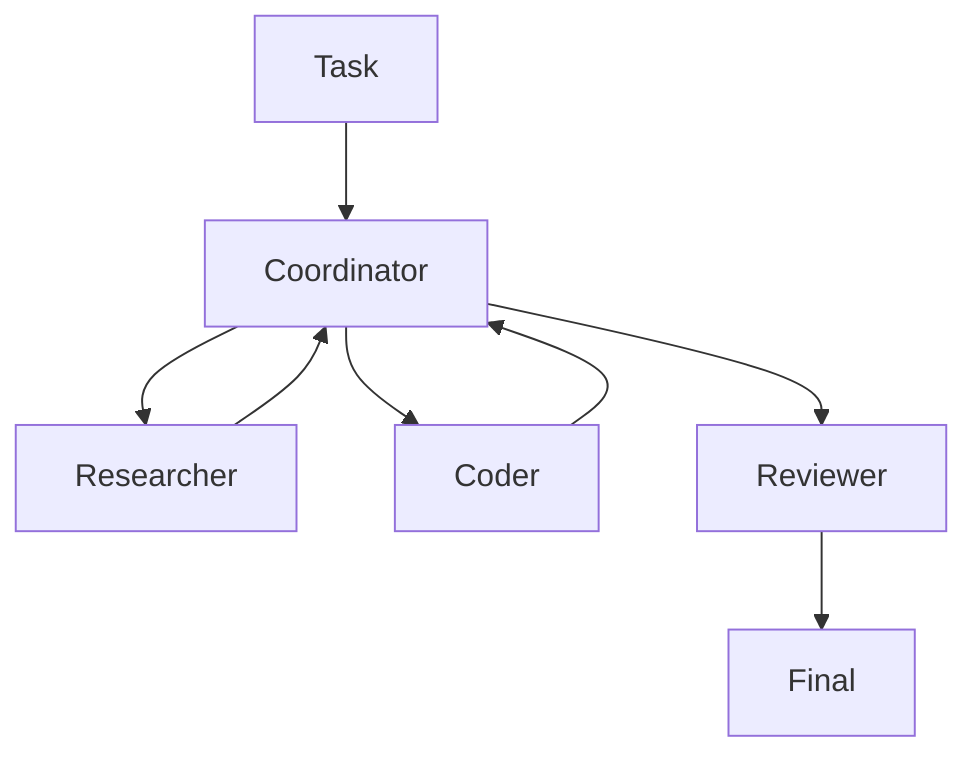

# Use case: Multi-agent team

## Goal

Split work across specialized roles:

- Coordinator (task decomposition)
- Researcher (gather sources)
- Coder (patch generation)
- Reviewer (safety + correctness)

## Pattern: orchestration

## Implementation notes

This repo ships a single-agent runtime. To build multi-agent teams:

- create multiple Agent instances with different configs
- share memory store(s) carefully (avoid cross-tenant leakage)
- add a coordinator that routes subtasks and merges outputs

