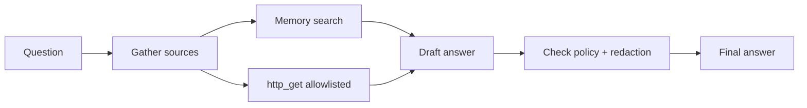

# Use case: Research assistant

## Goal

Answer questions with grounded references using:

- retrieval from local notes (memory)
- optional web fetching (http_get tool) with domain allowlist
- summarization and citation style

## Architecture pattern

- Reader phase: gather sources and snippets (tools)
- Writer phase: write answer and include citations
- Audit: store trace + retrieved snippets

## Implementation sketch

- Enable `policy.allow_network=true`
- Add domains to `policy.allowed_domains`
- Add a tool that formats citations for your org

